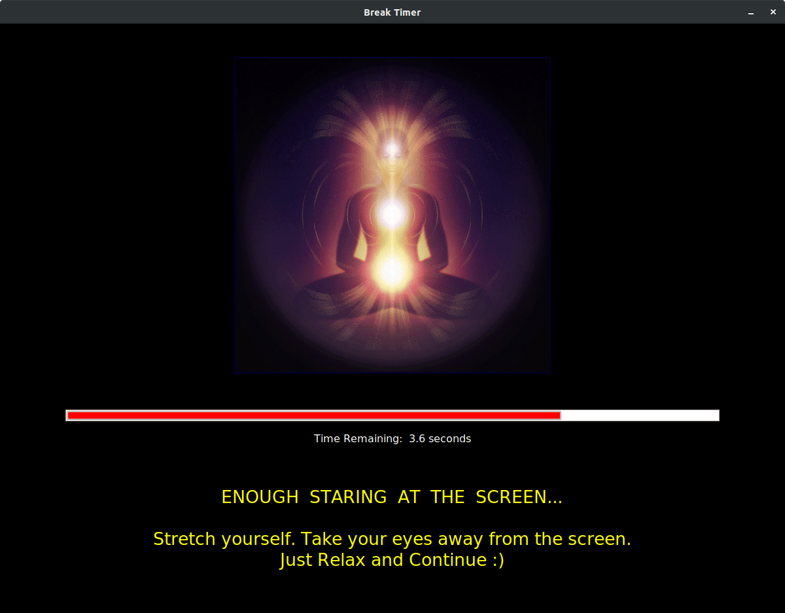

# Break-Timer

A utility like Break Timer is very essential when you are staring at the computer screen for long times!
Default relaxation time is 15 seconds.

## Made with

- [Python Tkinter](https://en.wikipedia.org/wiki/Tkinter)

#### Things to add on:

- [ ] Schedule this task using crontab to make it fully functioning
